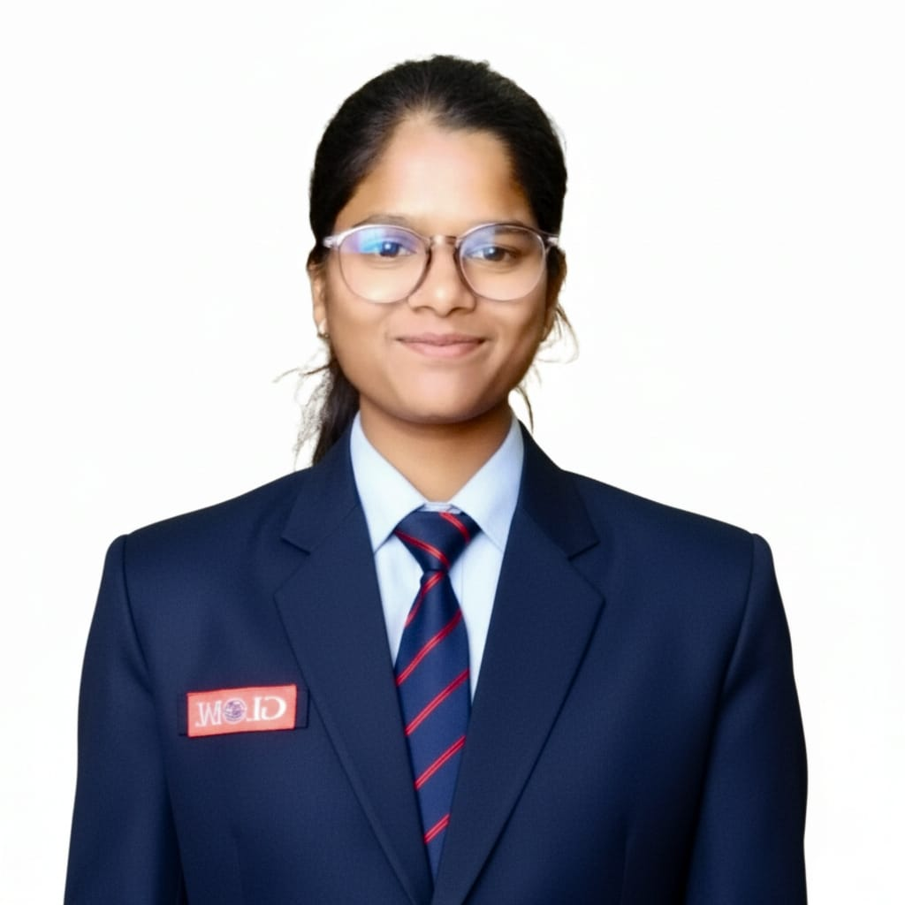

# 🚀 Sameeksha Vishwakarma - Portfolio

<div align="center">



**Full Stack Developer | MERN Stack Specialist | Problem Solver**

[](https://sameeksha-portfolio.vercel.app)
[](https://github.com/Sameeksha200416)
[](https://www.linkedin.com/in/sameeksha-vishwakarma16/)
[](mailto:sameekshavishwakarma16@gmail.com)

</div>

## 👋 About Me

Hello! I'm **Sameeksha Vishwakarma**, a passionate Full Stack Developer specializing in the MERN stack. Currently pursuing B.Tech in Computer Science and Engineering with specialization in IoT, Cybersecurity, and Blockchain at BGIEM Jabalpur (2022–2026). 

I love creating scalable, user-focused applications and am continuously enhancing my skills to deliver high-quality solutions. My journey in tech is driven by curiosity and the desire to solve real-world problems through code.

## 🛠️ Tech Stack

### Frontend


### Backend


### Languages


### Tools & Platforms


## 🚀 Featured Projects

### 🤖 AI Career Coach - SENSAi
**Next.js • React • Tailwind CSS • PostgreSQL • Prisma**
- AI-powered career development platform with Google Gemini AI integration
- Smart resume building, industry insights, and personalized career guidance
- Secure authentication and modern database management
- [🔗 Live Demo](https://ai-career-coach-seven-inky.vercel.app) | [💻 GitHub](https://github.com/Sameeksha200416/Ai-Career-Coach)

### 💬 Chatty App
**MERN Stack • Socket.io • JWT • Zustand**
- Full-stack real-time chat application with instant messaging
- Secure authentication flow and user presence tracking
- Responsive UI with TailwindCSS and Daisy UI
- [💻 GitHub](https://github.com/Sameeksha200416/FullStack-ChatApp)

### 🔗 URL-TRIMR
**React • Supabase • PostgreSQL • TailwindCSS**
- Modern URL shortener with QR code generation
- Real-time analytics including clicks, device info, and location tracking
- Custom aliases and secure user dashboard
- [🔗 Live Demo](https://url-trimr-nntu-15qz1sn6m-sameeksha200416s-projects.vercel.app/) | [💻 GitHub](https://github.com/Sameeksha200416/URL-TRIMR)

### 💊 SheCare AI
**React • FastAPI • Python • AI/ML**
- Women's health platform with menstrual cycle tracking
- PCOS risk assessment and AI-powered health chatbot
- Secure, personalized health management tools
- [🔗 Live Demo](https://shecare-ai-1-5jqe.onrender.com/) | [💻 GitHub](https://github.com/Sameeksha200416/SheCare-AI)

### 🖼️ AI Image Enhancer
**HTML • CSS • JavaScript • API Integration**
- AI-powered image enhancement tool
- Quality improvement through sharpening, color restoration, and upscaling
- Clean and intuitive user interface
- [🔗 Live Demo](https://ai-image-enhancer-v2.vercel.app/) | [💻 GitHub](https://github.com/Sameeksha200416/AI-Image-Enhancer-V2)

### 🔍 Dev Detective
**React • JavaScript • GitHub API**
- GitHub profile search and visualization tool
- Responsive design with dark mode support
- Comprehensive user profile details display
- [💻 GitHub](https://github.com/Sameeksha200416/Dev-Detective-Project)

## 🏆 Achievements & Hackathons

### 🥈 Ecopreneur Hackathon 2025 - 1st Runner-Up
*BGIEM Jabalpur | June 2025*
- Project RePouch: Smart refilling solution for reducing single-use plastic
- Focus on sustainable packaging and environmental impact

### 👩‍💻 HackSRIT 2025 - Best Girls Team
*SRIT Jabalpur | May 2025*
- HealthQ: AI-powered hospital queue and resource management system
- Innovative healthcare technology solution

### 🚀 Global Entrepreneurship Summit 2025
*IIT Kharagpur | February 2025*
- Networking with innovators and exposure to entrepreneurial ideas
- Learning from industry experts and thought leaders

## 📊 GitHub Stats

<div align="center">


</div>

## 🎓 Education

**Bachelor of Technology - Computer Science and Engineering**  
*Baderia Global Institute of Engineering and Management, Jabalpur*  
*2022 - 2026 | CGPA: 7.76*

**Specialization:** IoT, Cybersecurity, and Blockchain Technology

## 📫 Get In Touch

<div align="center">

[](mailto:sameekshavishwakarma16@gmail.com)
[](tel:+919644200416)
[](https://www.linkedin.com/in/sameeksha-vishwakarma16/)
[](https://github.com/Sameeksha200416)
[](https://sameeksha-portfolio.vercel.app)
[](https://codolio.com/profile/sameeksha_1_6/card)

**📍 Location:** Jabalpur, Madhya Pradesh, India

</div>

## 🌟 What I'm Currently Working On

- 🔭 Exploring advanced React patterns and performance optimization
- 🌱 Learning DevOps practices and cloud deployment strategies
- 👯 Open to collaborating on innovative web applications
- 💬 Ask me about MERN stack, React, or full-stack development
- ⚡ Fun fact: I love solving algorithmic challenges and contributing to open source!

## 📈 Portfolio Features

This portfolio website includes:
- **Responsive Design** - Works seamlessly across all devices
- **Modern UI/UX** - Clean, professional design with smooth animations
- **Interactive Elements** - Dynamic typing effects and hover animations
- **Contact Form** - Functional contact form with EmailJS integration
- **Dark Theme** - Eye-friendly dark mode design
- **Fast Performance** - Optimized with Vite for lightning-fast loading

## 🛠️ Installation & Setup

```bash
# Clone the repository
git clone https://github.com/Sameeksha200416/Sameeksha-Portfolio.git

# Navigate to project directory
cd Sameeksha-Portfolio

# Install dependencies
npm install

# Start development server
npm run dev

# Build for production
npm run build
```

## 📄 License

This project is open source and available under the [MIT License](LICENSE).

---

<div align="center">

**"Code is like humor. When you have to explain it, it's bad." - Cory House**

Made with ❤️ by [Sameeksha Vishwakarma](https://github.com/Sameeksha200416)

⭐ **Star this repository if you found it helpful!** ⭐

</div>